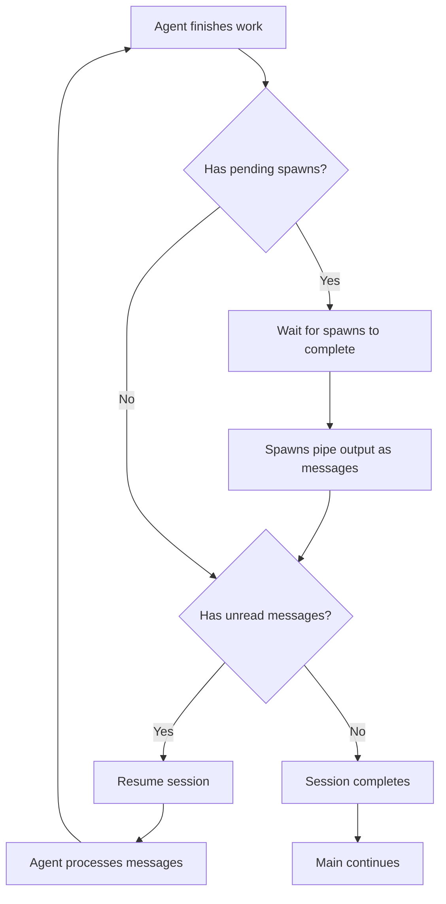
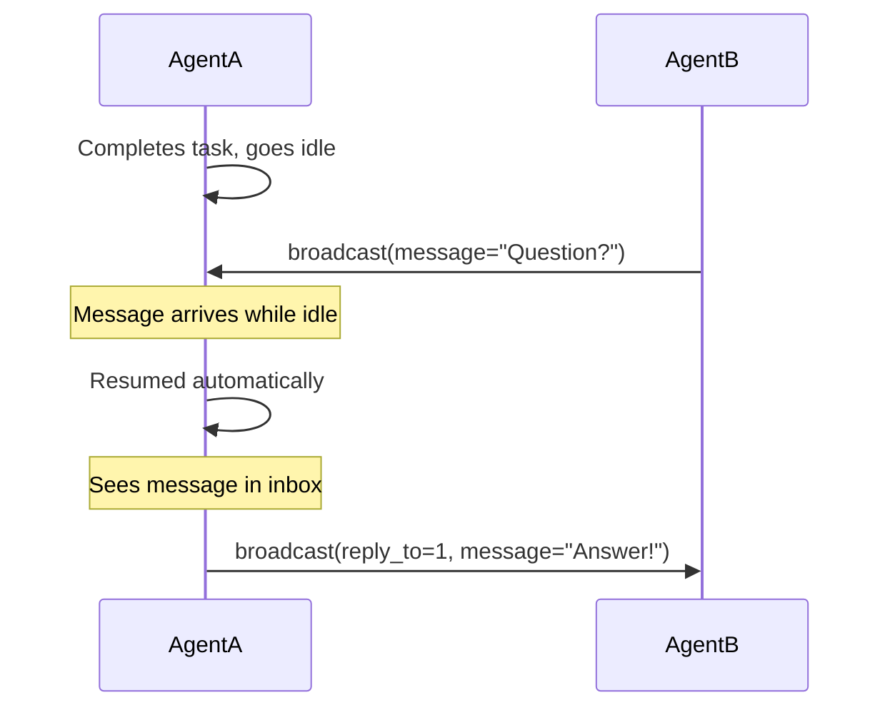

# Pocket Universe

## Async agents within a main thread block

Async agents are powerful but can lead to work getting orphaned and a bunch of your time and tokens... wasted. You fire, it forgets. Orchestration of such workflow is at best finick

**Pocket Universe fixes this.**

- **Fire-and-forget with callback** — Spawned agents run in parallel, but their output is always piped back to the caller
- **No wasted tokens** — Every model output is captured and delivered, guaranteed
- **Automatic resumption** — Idle agents wake up when messages arrive
- **Complete orchestration** — Main session waits for ALL work to finish before continuing

Within a single main session call, an entire universe of parallel work can unfold — agents spawning agents, communicating, coordinating — and the main session observes it all complete before moving on. No orphaned work. No lost context. No wasted compute. No guarantee this actually helps anything, but it's worth trying.

If you want background agents, open a new opencode session. If you want want async subagent with proper callback management within a main thread block, use this.

---

## How It Works


## Installation

```json
"plugin": ["@spoons-and-mirrors/pocket-universe@latest"]
```

## Tools

### `broadcast` — Inter-agent messaging

```
broadcast(message="...")                     # Send to all agents
broadcast(send_to="agentB", message="...")   # Send to specific agent
broadcast(reply_to=1, message="...")         # Reply to message #1
```

| Parameter  | Required | Description                                   |
| ---------- | -------- | --------------------------------------------- |
| `message`  | Yes      | Your message content                          |
| `send_to`  | No       | Target agent alias                            |
| `reply_to` | No       | Message ID to reply to (auto-wires recipient) |

### `spawn` — Create sibling agents

```
spawn(prompt="Build the login form", description="Login UI")
```

| Parameter     | Required | Description                   |
| ------------- | -------- | ----------------------------- |
| `prompt`      | Yes      | Task for the new agent        |
| `description` | No       | Short description (3-5 words) |

**Key behavior:**

- **Fire-and-forget**: `spawn()` returns immediately, caller continues working
- **Output piping**: When spawned agent completes, its output arrives as a message
- **Main blocks**: The main session waits for ALL spawns and resumed sessions

## Session Lifecycle



The `session.before_complete` hook ensures no work is left behind:

1. Agent finishes its work
2. Hook checks for pending spawns → waits for them
3. Spawned agents pipe output to caller as messages
4. Hook checks for unread messages → resumes session
5. Agent processes messages, hook fires again
6. Only when nothing pending does the session complete
7. Main session continues with the complete result

## Session Resumption

Idle agents automatically wake up when they receive messages:



## Receiving Messages

Messages appear as synthetic `broadcast` tool results:

```json
{
  "tool": "broadcast",
  "state": {
    "input": { "synthetic": true },
    "output": {
      "agents": [{ "name": "agentA", "status": "Working on frontend" }],
      "messages": [{ "id": 1, "from": "agentA", "content": "Need help?" }]
    }
  }
}
```

- **`synthetic: true`** — Injected by Pocket Universe, not a real tool call
- **`agents`** — All sibling agents and their status (always visible)
- **`messages`** — Inbox messages, reply using `reply_to`

## Example: Parallel Work with Spawn

```
Main Session:
  -> task(prompt="Build feature X")

AgentA:
  -> broadcast(message="Building feature X")
  -> spawn(prompt="Create the API", description="API work")
     # Returns immediately, agentA continues
  -> ... does frontend work ...
  -> Finishes own work

  # Before completing:
  # - Waits for spawned agentB
  # - agentB completes, output piped to agentA
  # - agentA resumed to process output

  -> Sees agentB's API output in inbox
  -> Integrates API with frontend
  -> Completes with full result

Main Session:
  -> Receives complete result (frontend + API integrated)
```

## Architecture

| Component                 | Purpose                                                    |
| ------------------------- | ---------------------------------------------------------- |
| `broadcast`               | Send/receive messages between agents                       |
| `spawn`                   | Create sibling agents (fire-and-forget with output piping) |
| Synthetic injection       | Show agents + messages on every LLM call                   |
| `session.before_complete` | Wait for spawns, trigger resumes                           |
| Output piping             | Spawned agent output → caller inbox                        |
| Session resumption        | Wake idle agents on new messages                           |

## OpenCode Hook

Pocket Universe uses the `session.before_complete` hook:

```typescript
"session.before_complete"?: (
  input: { sessionID: string; parentSessionID?: string },
  output: { waitForSessions: string[]; resumePrompt?: string },
) => Promise<void>
```

- `waitForSessions` — Session IDs to wait for before completing
- `resumePrompt` — If set, starts a new prompt cycle and waits for it
