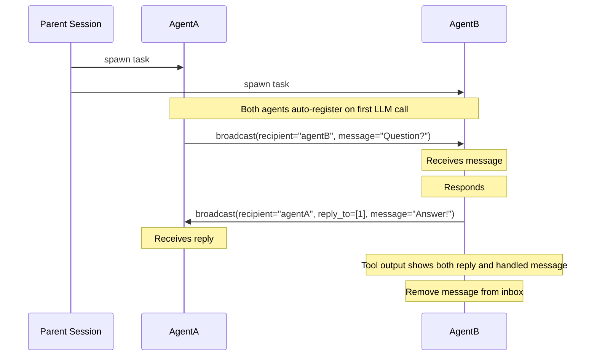

# IAM (Inter-Agent Messaging)

Enable parallel agents communication for opencode

`@spoons-and-mirrors/iam@latest`

## How It Works

Parallel agents they can send messages to each other using the `broadcast` tool. Messages are relayed to the proper agent's context.



## The `broadcast` Tool

```
broadcast(message="...")                                 # Send to all agents
broadcast(recipient="agentB", message="...")             # Send to specific agent
broadcast(reply_to=[1, 2], message="...")                # Mark messages as handled
broadcast(recipient="agentA", reply_to=[1], message="...") # Reply and mark handled
```

### Parameters

| Parameter   | Required | Description                                                          |
| ----------- | -------- | -------------------------------------------------------------------- |
| `message`   | Yes      | Your message content                                                 |
| `recipient` | No       | Target agent(s), comma-separated. Omit to send to all                |
| `reply_to`  | No       | Array of message IDs to mark as handled (e.g., `[1]` or `[1, 2, 3]`) |

## Receiving Messages

Messages appear as a `broadcast` tool result with structured data:

```json
{
  "messages": [
    { "id": 1, "from": "agentA", "body": "What's the status on the API?" },
    { "id": 2, "from": "agentA", "body": "Also, can you check the tests?" }
  ],
  "agents": ["agentA", "agentC: Working on backend"]
}
```

The `agents` array always shows available agents to message. This is injected even when there are no incoming messages.

Messages persist in the inbox until the agent marks them as handled using `reply_to`.

## Installation

Add to your OpenCode config:

```
"plugin": ["@spoons-and-mirrors/iam@latest"]
```

## Example Workflow

```
# Parent spawns two agents to work on different parts of a feature

AgentA (working on frontend):
  → broadcast(message="Starting frontend work")
  → ... does work ...
  → broadcast(recipient="agentB", message="Need the API schema")

AgentB (working on backend):
  → broadcast(message="Starting backend work")
  → ... sees AgentA's question in inbox ...
  → broadcast(recipient="agentA", reply_to=[1], message="Here's the schema: {...}")

AgentA:
  → ... sees AgentB's response in inbox ...
  → broadcast(reply_to=[1], message="Got it, thanks!")
```

## Notes

- Agents are assigned aliases automatically: `agentA`, `agentB`, `agentC`, etc.
- Logs are written to `.logs/iam.log` for debugging
