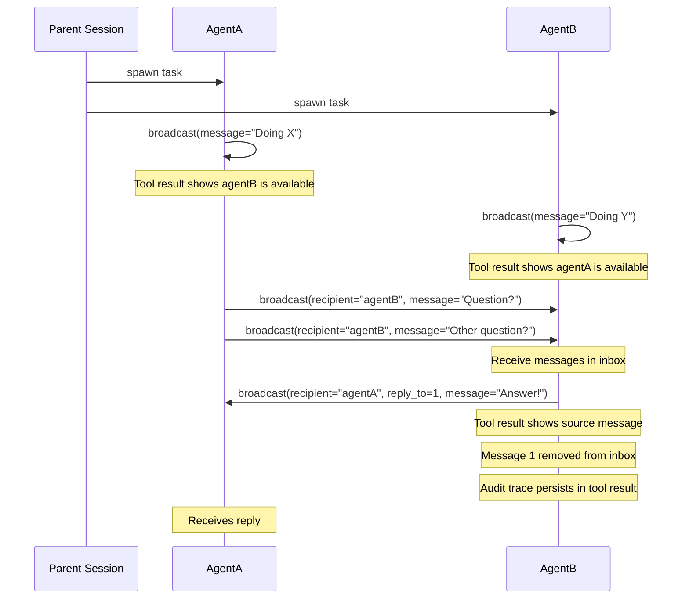

# IAM (Inter-Agent Messaging)

Enable parallel agents communication for opencode

`@spoons-and-mirrors/iam@latest`

## How It Works

Parallel agents can send messages to each other using the `broadcast` tool. Messages are relayed to the proper agent's context.



## The `broadcast` Tool

```
broadcast(message="...")                                  # Send to all agents
broadcast(recipient="agentB", message="...")              # Send to specific agent
broadcast(reply_to=1, message="...")                      # Mark message as handled
broadcast(recipient="agentA", reply_to=1, message="...")  # Reply and mark handled
```

### Parameters

| Parameter   | Required | Description                               |
| ----------- | -------- | ----------------------------------------- |
| `message`   | Yes      | Your message content                      |
| `recipient` | No       | Target agent(s), comma-separated          |
| `reply_to`  | No       | Message ID to mark as handled (e.g., `1`) |

## Receiving Messages

Messages appear as a `broadcast` tool result with structured data:

```json
{
  "messages": [
    {"id": 1, "from": "agentA", "body": "What's the status on the API?"},
    {"id": 2, "from": "agentA", "body": "Also, can you check the tests?"}
  ]
}
```

Messages persist in the inbox until the agent marks them as handled using `reply_to`.

**Discovery:** Agents discover each other by calling `broadcast` - the tool result shows all available agents.

## Installation

Add to your OpenCode config:

```
"plugin": ["@spoons-and-mirrors/iam@latest"]
```

## Example Workflow

```
# Parent spawns two agents to work on different parts of a feature

AgentA (working on frontend):
  -> broadcast(message="Starting frontend work")
     # Tool result shows: "Available agents: agentB"
  -> ... does work ...
  -> broadcast(recipient="agentB", message="Need the API schema")

AgentB (working on backend):
  -> broadcast(message="Starting backend work")
     # Tool result shows: "Available agents: agentA"
  -> ... sees AgentA's question in inbox ...
  -> broadcast(recipient="agentA", reply_to=1, message="Here's the schema: {...}")
     # Tool result shows: Marked as handled: #1 from agentA

AgentA:
  -> ... sees AgentB's response in inbox ...
  -> broadcast(reply_to=1, message="Got it, thanks!")
```
