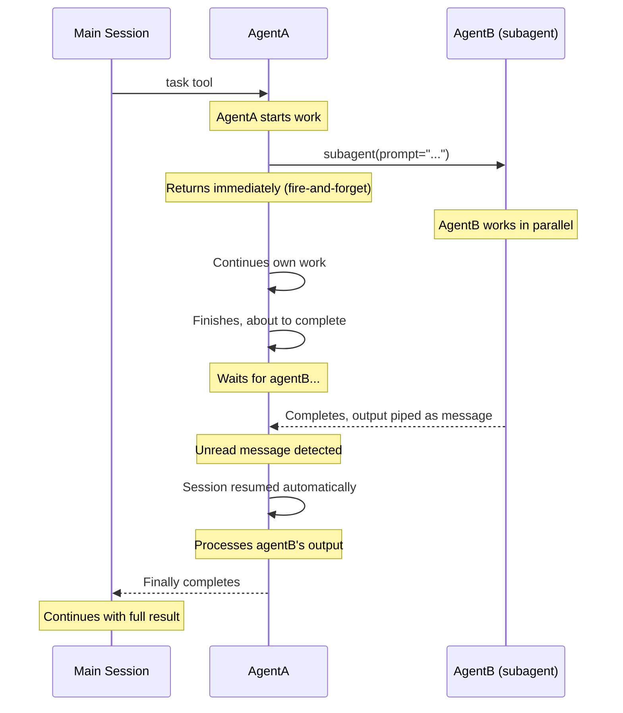
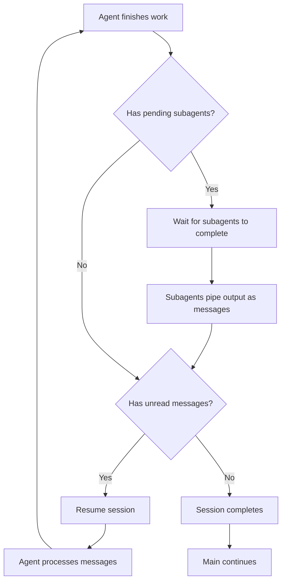
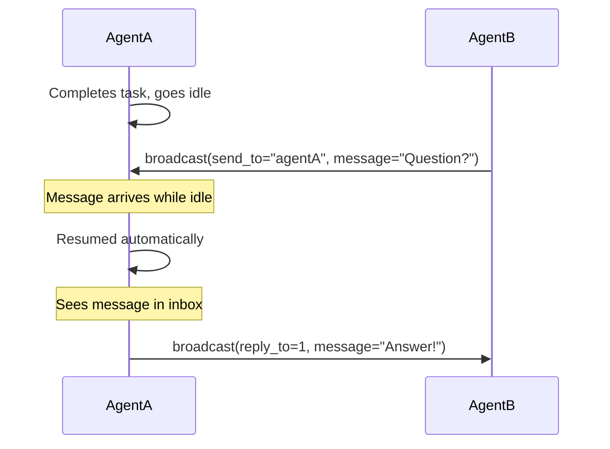

# Pocket Universe

## An agentic closed loop with async capabilities

Async agents can be powerful, but orchestration is at best finicky; they fire and _forget_, orphan work, lose context, waste time... and tokens. This plugin extends the native opencode subagent paradigm to provide: closed loop, resilient, async agents, blocking main thread execution. A _"pocket universe"_.

This ships with three tools creating a robust system for parallel agents to communicate and coordinate work:

- `broadcast` (async) is the messaging system, subagents can send or reply to others and update own status
- `subagent` (async) creates a sibling subagent, the caller receives the output mid-stream (or resumes if idle)
- `recall` allows access to subagents' status history, can also return subagent output (disabled by default)

### Key Features

- **attention** is all they need, agents are accutely aware each other
- **resume** idle agents upon receiving a `broadcast` or `subagent` result
- **block** main session until all subagents in the _pocket universe_ complete
- **depth** control to limit runaway subagent spawning
- **worktree** support for isolated agent workspaces (disabled by default)
- **configurable** all tools work as standalone, can be enabled/disabled via config

### TL:DR

Harness forks like Oh My Opencode should really run on top of this

### Installation

Add Pocket Universe to your opencode config's plugin array

```json
"plugin": ["@spoons-and-mirrors/pocket-universe@latest"]
```

---

<details>
<summary>Diagram</summary>
    
### How It Works



</details>

<details>
<summary>Tools</summary>

### `broadcast` — Inter-agent messaging

```
broadcast(message="...")                     # Status update (visible to all, not queued)
broadcast(send_to="agentB", message="...")   # Direct message (queued, replyable)
broadcast(reply_to=1, message="...")         # Reply to message #1
```

| Parameter  | Required | Description                                   |
| ---------- | -------- | --------------------------------------------- |
| `message`  | Yes      | Your message content                          |
| `send_to`  | No       | Target agent alias                            |
| `reply_to` | No       | Message ID to reply to (auto-wires recipient) |

**Status vs Messages:**

- **Without `send_to`**: Updates your status history (other agents see it in the agent list). Passive visibility only — does NOT send messages or wake agents.
- **With `send_to`**: Sends a direct message that appears in the recipient's inbox and is replyable.

**Status history:** Each agent's status updates are tracked as a history. When you see an agent, you see all their status updates in order, showing what they've been doing.

### `subagent` — Create sibling agents

```
subagent(prompt="Build the login form", description="Login UI")
```

| Parameter     | Required | Description                   |
| ------------- | -------- | ----------------------------- |
| `prompt`      | Yes      | Task for the new agent        |
| `description` | No       | Short description (3-5 words) |

**Key behavior:**

- **Async firing**: `subagent()` returns immediately, caller continues working
- **Output piping**: When subagent completes, its output arrives as a message in the caller session (and wakes it if idle)
- **Main thread block**: The main session waits for ALL subagents to complete before continuing
- **Model inheritance**: Subagents automatically inherit the caller's agent and model (no fallback to defaults)

### `recall` — Query agent history

```
recall()                                        # Get all agents' status histories
recall(agent_name="agentA")                     # Get specific agent's history
recall(agent_name="agentA", show_output=true)   # Include agent's final output
```

| Parameter     | Required | Description                                                   |
| ------------- | -------- | ------------------------------------------------------------- |
| `agent_name`  | No       | Specific agent to recall (omit for all agents)                |
| `show_output` | No       | Include final output (only works with `agent_name` specified) |

**Key behavior:**

- **Persists across cleanups**: History survives pocket universe cleanup, so agents in batch 2 can recall what batch 1 agents did
- **Status history only by default**: Output is only shown when BOTH `agent_name` AND `show_output=true` are specified
- **Active agent handling**: If you request output for an agent that's still active, you'll get `[Agent is still active - no output yet]`

**Example response:**

```json
{
  "agents": [
    {
      "name": "agentA",
      "status_history": ["Working on login form", "Integrating API"],
      "state": "completed",
      "output": "Login form implemented with OAuth support..."
    }
  ]
}
```

**Use cases:**

- New agent needs to know what previous agents accomplished
- Agent wants to check if another agent finished and see their results
- Coordinating work based on what others have done

</details>

<details>
<summary>Commands</summary>

### `/pocket` — Send messages to agents

While a pocket universe is running, you can send messages directly to agents from the main session:

```
/pocket @agentB wrap it up       → sends to agentB specifically
/pocket wrap it up               → sends to coordinator (first agent)
```

**Setup:**

Copy the command template to your OpenCode commands directory:

```bash
# Global (works everywhere)
cp ~/.config/opencode/plugin/pocket-universe/command/pocket.md ~/.opencode/command/pocket.md

# Or project-local
cp ~/.config/opencode/plugin/pocket-universe/command/pocket.md .opencode/command/pocket.md
```

**Behavior:**

- Message sender appears as `"user"` so agents know it came from you
- If the target agent is idle, it will be resumed automatically
- Only works when a pocket universe is active (agents are running)

**Safety:**

- Cannot message agents from previous pockets (already completed)
- Returns an error if no pocket is currently active
- Returns an error if the specified agent doesn't exist

**Use cases:**

- Give agents mid-task instructions: `/pocket @agentB also add unit tests`
- Redirect work: `/pocket @agentA hand off the API work to agentB`
- Signal urgency: `/pocket wrap it up, we need to ship`

</details>

<details>
<summary>Session Lifecycle</summary>



The `session.before_complete` hook ensures no work is left behind:

1. Agent finishes its work
2. Hook checks for pending subagents → waits for them
3. Subagents pipe output to caller as messages
4. Hook checks for unread messages → resumes session
5. Agent processes messages, hook fires again
6. Only when nothing pending does the session complete
7. Main session continues with the complete result

</details>

<details>
<summary>Session Resumption</summary>

Idle agents automatically wake up when they receive messages:



</details>

<details>
<summary>Receiving Messages</summary>

Messages appear as synthetic `broadcast` tool results:

```json
{
  "tool": "broadcast",
  "state": {
    "input": { "synthetic": true },
    "output": {
      "you_are": "agentB",
      "agents": [
        {
          "name": "agentA",
          "status": ["searching for X", "found X in file.ts"],
          "idle": true
        }
      ],
      "messages": [{ "id": 1, "from": "agentA", "content": "Need help?" }]
    }
  }
}
```

- **`synthetic: true`** — Injected by Pocket Universe, not a real tool call
- **`you_are`** — Your agent name (always included so you know your identity)
- **`agents`** — All sibling agents and their status history (array of status updates)
- **`idle`** — True if the agent has completed and is no longer active
- **`messages`** — Inbox messages, reply using `reply_to`

**Reply audit trail:** When you reply using `reply_to`, the tool output includes the FULL original message you're replying to, providing a complete audit trail.

</details>

<details>
<summary>Pocket Universe Summary</summary>

When all parallel agent work completes, the main session receives a **Pocket Universe Summary** as a persisted user message. This includes:

- All agents that ran
- Their full status history
- Their worktree paths (if enabled)

Example summary:

```
[Pocket Universe Summary]

The following agents completed their work:

## agentA
Worktree: /repo/.worktrees/agentA
Status history:
  → searching for auth implementation
  → found auth in src/auth.ts
  → sending findings to agentB

## agentB
Worktree: /repo/.worktrees/agentB
Status history:
  → implementing login form
  → integrating auth from agentA
  → completed login feature

Note: Agent changes are preserved in their worktrees. Review and merge as needed.
```

This summary is **persisted to the database** so it survives crashes and is part of the conversation history.

**Automatic cleanup:** After the summary is injected, all agent tracking state is cleared. This means the next batch of tasks starts fresh — no stale agents from previous work appear in `getParallelAgents()`.

**Parallel task handling:** If the main session spawns multiple task tools in parallel (e.g., `task(agentA)` and `task(agentB)` simultaneously), the summary is only injected after ALL first-level children complete. This ensures the summary contains work from all agents, not just the first one to finish.

</details>

<details>
<summary>Isolated Worktrees</summary>

Each agent operates in its own **git worktree** — a clean checkout from the last commit (HEAD). This provides isolation so agents can work in parallel without conflicting with each other.

### How It Works

```
repo/
├── .worktrees/
│   ├── agentA/     ← agentA's isolated working directory
│   ├── agentB/     ← agentB's isolated working directory
│   └── agentC/     ← agentC's isolated working directory
└── (main repo)     ← main session's working directory
```

When an agent is created (via `task` or `subagent`):

1. A new worktree is created at `.worktrees/<alias>` (detached from HEAD)
2. The agent sees its worktree path in its system prompt
3. All sibling agents can see each other's worktree paths via `broadcast`

### Agent System Prompt

Each agent receives its worktree path:

```xml
<worktree>
Your isolated working directory: /repo/.worktrees/agentB
ALL file operations (read, write, edit, bash) should use paths within this directory.
Do NOT modify files outside this worktree.
</worktree>
```

### Broadcast Shows Worktrees

When agents see each other via broadcast, worktree paths are included so they know where each agent is working.

### Worktree Paths in Summary

The main session’s Pocket Universe Summary includes each agent’s worktree path when worktrees are enabled.

### Worktree Lifecycle

| Event                 | Behavior                                           |
| --------------------- | -------------------------------------------------- |
| Agent created         | Worktree created at `.worktrees/<alias>` from HEAD |
| Agent completes       | **Worktree preserved** with all changes            |
| Stale worktree exists | Automatically cleaned up before creating new one   |

**Important:** Worktrees are **not deleted** when agents complete. The agent's changes are preserved for you to review and merge manually.

### Limitations

Worktree isolation relies on agents following instructions to use their assigned paths. The LLM may occasionally write to the wrong location. For guaranteed isolation, OpenCode core changes would be needed (per-session working directory).

</details>

<details>
<summary>Configuration</summary>

Pocket Universe uses feature flags to control optional functionality. Configuration is loaded from two locations (in priority order):

1. **Project-specific:** `.pocket-universe.jsonc` in your current directory
2. **Global:** `~/.config/opencode/pocket-universe.jsonc` (auto-created if missing)

### Config File Format

```jsonc
{
  // Tool enablement flags
  "tools": {
    // Enable the broadcast tool for inter-agent messaging
    "broadcast": true,

    // Enable the subagent tool for creating sibling agents
    "subagent": true,

    // Enable the recall tool for querying agent history
    "recall": false,
  },

  // Tool configuration parameters
  "parameters": {
    // Max session depth allowed to spawn subagents (main session = 0, exclusive)
    "subagent_max_depth": 3,

    // When true (default), subagent results appear in broadcast inbox.
    // When false, subagent results are injected as persisted user message.
    "subagent_result_forced_attention": true,

    // When true (default), recall can access agents from prior pocket universes.
    // When false, recall only shows current pocket universe agents.
    "recall_cross_pocket": true,
  },

  // Enable isolated git worktrees for each agent
  // Each agent gets its own clean checkout from HEAD
  "worktree": false,

  // Enable debug logging to .logs/pocket-universe.log
  "logging": false,
}
```

### Feature Flags

**`tools`**

| Flag        | Default | Description                                            |
| ----------- | ------- | ------------------------------------------------------ |
| `broadcast` | `true`  | Enable the `broadcast` tool for inter-agent messaging  |
| `subagent`  | `true`  | Enable the `subagent` tool for creating sibling agents |
| `recall`    | `false` | Enable the `recall` tool for querying agent history    |

**`parameters`**

| Parameter                          | Default | Description                                                                                           |
| ---------------------------------- | ------- | ----------------------------------------------------------------------------------------------------- |
| `subagent_max_depth`               | `3`     | Max session depth allowed to spawn subagents (main session = 0, exclusive)                            |
| `subagent_result_forced_attention` | `true`  | When true, subagent output appears in broadcast inbox; when false, injected as persisted user message |
| `recall_cross_pocket`              | `true`  | When true, recall can access agents from prior pocket universes                                       |

**Top-level**

| Flag       | Default | Description                                     |
| ---------- | ------- | ----------------------------------------------- |
| `worktree` | `false` | Create isolated git worktrees for each agent    |
| `logging`  | `false` | Write debug logs to `.logs/pocket-universe.log` |

</details>
