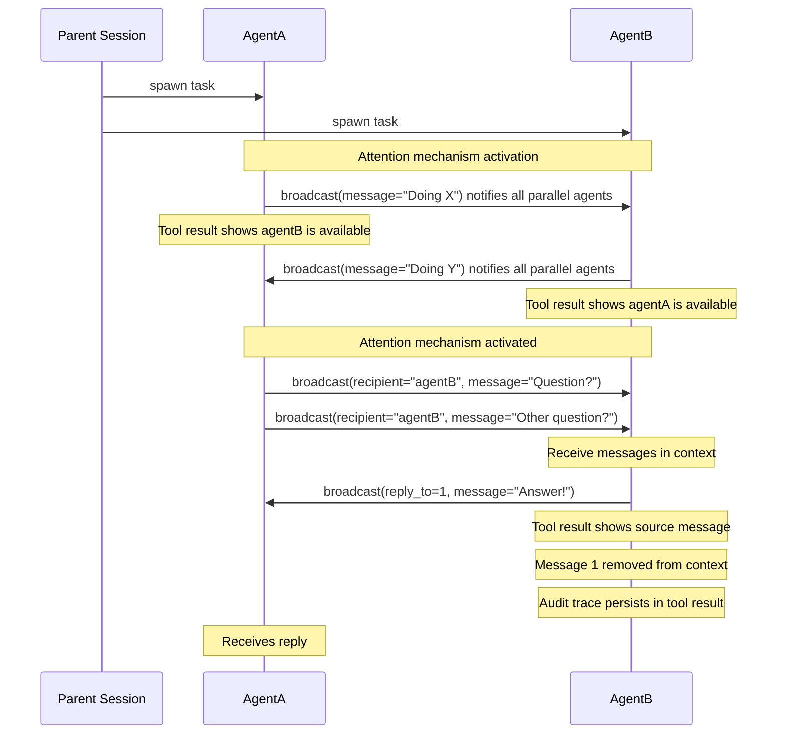

# IAM (Inter-Agent Messaging)

### Enable parallel agents communication for opencode


## How It Works



## Installation

Add to your OpenCode config:

```
"plugin": ["@spoons-and-mirrors/iam@latest"]
```

## The `broadcast` Tool

```
broadcast(message="...")                     # Send to all agents
broadcast(recipient="agentB", message="...") # Send to specific agent
broadcast(reply_to=1, message="...")         # Reply to message #1 (auto-wires recipient)
```

### Parameters

| Parameter   | Required | Description                                                     |
| ----------- | -------- | --------------------------------------------------------------- |
| `message`   | Yes      | Your message content                                            |
| `recipient` | No       | Target agent (single agent only)                                |
| `reply_to`  | No       | Message ID to reply to - auto-wires recipient to message sender |

## Receiving Messages

Messages are injected as a synthetic `broadcast` tool result. Here's the complete structure:

```json
{
  "tool": "broadcast",
  "state": {
    "status": "completed",
    "input": { "synthetic": true },
    "output": {
      "agents": [
        { "name": "agentA", "status": "Working on frontend components" }
      ],
      "messages": [
        {
          "id": 1,
          "from": "agentA",
          "content": "What's the status on the API?"
        },
        {
          "id": 2,
          "from": "agentA",
          "content": "Also, can you check the tests?"
        }
      ]
    },
    "title": "1 agent(s), 2 message(s)"
  }
}
```

- **`input.synthetic`**: Indicates this was injected by IAM, not a real agent call
- **`output.agents`**: Status announcements from other agents (not replyable)
- **`output.messages`**: Actual messages you can reply to using `reply_to`

Messages persist in the inbox until the agent marks them as handled using `reply_to`.

**Discovery:** Agents discover each other by calling `broadcast` which activates the attention mechanism.

## Attention Layer

On every LLM fetch, pending inbox messages are injected as a synthetic `broadcast` tool result at the end of the message chain. The synthetic call has `input: { synthetic: true }` to indicate it was injected by IAM, not a real agent call.

After injection, the message chain looks like:

1. system prompt
2. user message
3. assistant response
4. tool calls...
5. user message
6. **`[broadcast]` 1 agent(s), 2 message(s)** ← injected at end

## Example Workflow

```
# Parent spawns two agents to work on different parts of a feature

AgentA (working on frontend):
  -> broadcast(message="Starting frontend work")
     # Tool result shows: "Available agents: agentB"
  -> ... does work ...
  -> broadcast(recipient="agentB", message="Need the API schema")

AgentB (working on backend):
  -> broadcast(message="Starting backend work")
     # Tool result shows: "Available agents: agentA"
  -> ... sees AgentA's question in inbox ...
  -> broadcast(reply_to=1, message="Here's the schema: {...}")
     # Tool result shows: Marked as handled: #1 from agentA
     # Recipient auto-wired to agentA

AgentA:
  -> ... sees AgentB's response in inbox ...
  -> broadcast(reply_to=1, message="Got it, thanks!")
     # Recipient auto-wired to agentB
```
