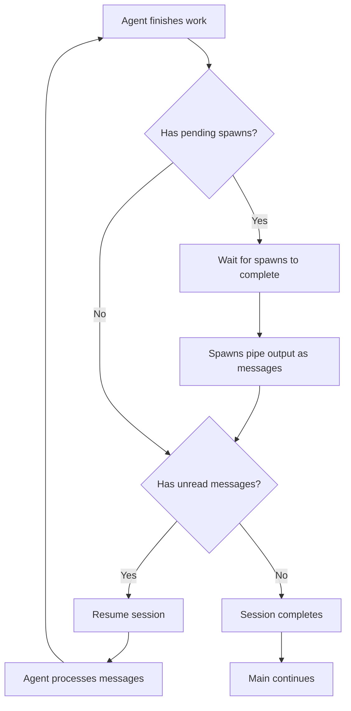
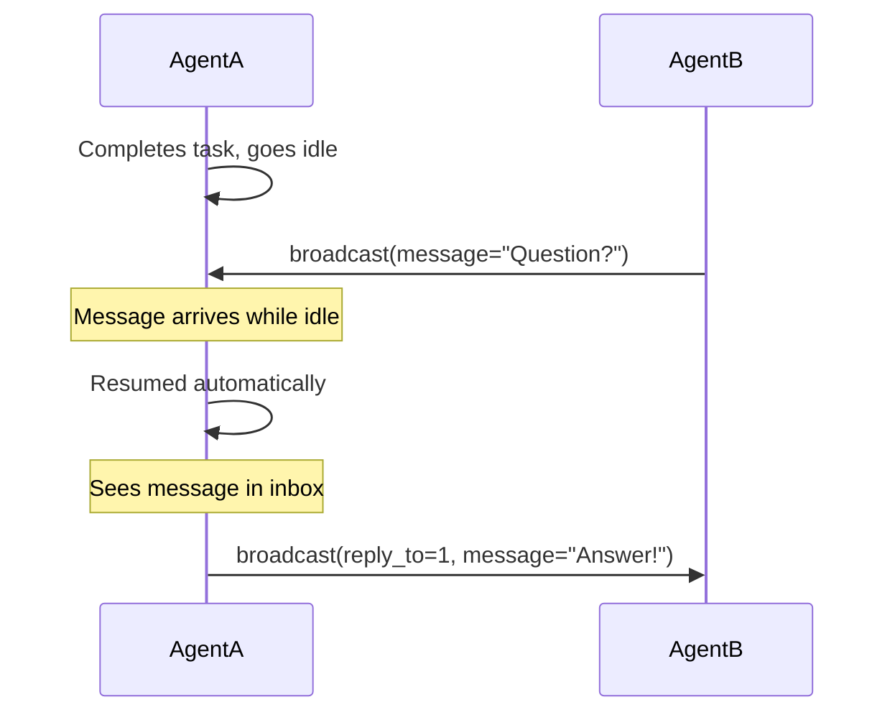

# Pocket Universe

## Async agents within a main thread block

Async agents are powerful but can lead to work getting orphaned and a bunch of your time and tokens... wasted. You fire, it forgets. Orchestration of such workflow is at best finicky.

**Pocket Universe fixes this.**

- **Fire-and-forget with callback** — Spawned agents run in parallel, but their output is always piped back to the caller
- **No wasted tokens** — Every model output is captured and delivered, guaranteed
- **Automatic resumption** — Idle agents wake up when messages arrive
- **Complete orchestration** — Main session waits for ALL work to finish before continuing
- **Isolated worktrees** — Each agent works in its own git worktree, no conflicts

Within a single main session call, an entire universe of parallel work can unfold — agents spawning agents, communicating, coordinating — and the main session observes it all complete before moving on. No orphaned work. No lost context. No wasted compute. No guarantee this actually helps anything, but it's worth trying.

If you want background agents, open a new opencode session. If you want want async subagent with proper callback management within a main thread block, use this.

---

## How It Works


## Installation

```json
"plugin": ["@spoons-and-mirrors/pocket-universe@latest"]
```

<details>
<summary>Tools</summary>

### `broadcast` — Inter-agent messaging

```
broadcast(message="...")                     # Status update (visible to all, not queued)
broadcast(send_to="agentB", message="...")   # Direct message (queued, replyable)
broadcast(reply_to=1, message="...")         # Reply to message #1
```

| Parameter  | Required | Description                                   |
| ---------- | -------- | --------------------------------------------- |
| `message`  | Yes      | Your message content                          |
| `send_to`  | No       | Target agent alias                            |
| `reply_to` | No       | Message ID to reply to (auto-wires recipient) |

**Status vs Messages:**

- **Without `send_to`**: Updates your status history (other agents see it in the agent list). Passive visibility only — does NOT send messages or wake agents.
- **With `send_to`**: Sends a direct message that appears in the recipient's inbox and is replyable.

**Status history:** Each agent's status updates are tracked as a history. When you see an agent, you see all their status updates in order, showing what they've been doing.

### `spawn` — Create sibling agents

```
spawn(prompt="Build the login form", description="Login UI")
```

| Parameter     | Required | Description                   |
| ------------- | -------- | ----------------------------- |
| `prompt`      | Yes      | Task for the new agent        |
| `description` | No       | Short description (3-5 words) |

**Key behavior:**

- **Async firing**: `spawn()` returns immediately, caller continues working
- **Output piping**: When spawned agent completes, its output arrives as a message in the caller session (and wakes it if idle)
- **Main thread block**: The main session waits for ALL subagents to complete before continuing

</details>

<details>
<summary>Session Lifecycle</summary>



The `session.before_complete` hook ensures no work is left behind:

1. Agent finishes its work
2. Hook checks for pending spawns → waits for them
3. Spawned agents pipe output to caller as messages
4. Hook checks for unread messages → resumes session
5. Agent processes messages, hook fires again
6. Only when nothing pending does the session complete
7. Main session continues with the complete result

</details>

<details>
<summary>Session Resumption</summary>

Idle agents automatically wake up when they receive messages:



</details>

<details>
<summary>Receiving Messages</summary>

Messages appear as synthetic `broadcast` tool results:

```json
{
  "tool": "broadcast",
  "state": {
    "input": { "synthetic": true },
    "output": {
      "agents": [{ "name": "agentA", "status": "Working on frontend" }],
      "messages": [{ "id": 1, "from": "agentA", "content": "Need help?" }]
    }
  }
}
```

- **`synthetic: true`** — Injected by Pocket Universe, not a real tool call
- **`agents`** — All sibling agents and their status (always visible)
- **`messages`** — Inbox messages, reply using `reply_to`

</details>

<details>
<summary>Isolated Worktrees</summary>

Each agent operates in its own **git worktree** — a clean checkout from the last commit (HEAD). This provides isolation so agents can work in parallel without conflicting with each other.

### How It Works

```
repo/
├── .worktrees/
│   ├── agentA/     ← agentA's isolated working directory
│   ├── agentB/     ← agentB's isolated working directory
│   └── agentC/     ← agentC's isolated working directory
└── (main repo)     ← main session's working directory
```

When an agent is created (via `task` or `spawn`):

1. A new worktree is created at `.worktrees/<alias>` (detached from HEAD)
2. The agent sees its worktree path in its system prompt
3. All sibling agents can see each other's worktree paths via `broadcast`

### Agent System Prompt

Each agent receives its worktree path:

```xml
<worktree>
Your isolated working directory: /repo/.worktrees/agentB
ALL file operations (read, write, edit, bash) should use paths within this directory.
Do NOT modify files outside this worktree.
</worktree>
```

### Broadcast Shows Worktrees

When agents see each other via broadcast, worktree paths are included so they know where each agent is working.

### Main Session Worktree Summary

The main session receives a summary showing all active agent worktrees, their tasks, and their paths.

### Worktree Lifecycle

| Event                 | Behavior                                           |
| --------------------- | -------------------------------------------------- |
| Agent created         | Worktree created at `.worktrees/<alias>` from HEAD |
| Agent completes       | **Worktree preserved** with all changes            |
| Stale worktree exists | Automatically cleaned up before creating new one   |

**Important:** Worktrees are **not deleted** when agents complete. The agent's changes are preserved for you to review and merge manually.

### Limitations

Worktree isolation relies on agents following instructions to use their assigned paths. The LLM may occasionally write to the wrong location. For guaranteed isolation, OpenCode core changes would be needed (per-session working directory).

</details>

<details>
<summary>Configuration</summary>

Pocket Universe uses feature flags to control optional functionality. Configuration is loaded from two locations (in priority order):

1. **Project-specific:** `.pocket-universe.jsonc` in your current directory
2. **Global:** `~/.config/opencode/pocket-universe.jsonc` (auto-created if missing)

### Config File Format

```jsonc
{
  "worktree": false,
  "spawn": true,
  "logging": false,
}
```

### Feature Flags

| Flag                            | Default | Description                                                                                        |
| ------------------------------- | ------- | -------------------------------------------------------------------------------------------------- |
| `worktree`                      | `false` | Create isolated git worktrees for each agent                                                       |
| `spawn`                         | `true`  | Enable the `spawn` tool for creating sibling agents                                                |
| `logging`                       | `false` | Write debug logs to `~/.config/opencode/plugin/iam/pocket-universe.log`                            |
| `spawn_result_forced_attention` | `true`  | When true, spawn output appears in broadcast inbox; when false, injected as persisted user message |

### Behavior When Disabled

**`worktree: false`**

- No worktrees are created
- Worktree sections are hidden from system prompts and broadcasts
- Agents work in the main repository (potential for conflicts)

**`spawn: false`**

- The `spawn` tool is not registered
- Agents cannot create new sibling agents
- Spawn instructions are hidden from the system prompt

**`logging: false`**

- No log file is created
- Reduces disk I/O

**`spawn_result_forced_attention: true`** (default)

- Spawn output appears in the broadcast inbox (synthetic injection)
- Message is replyable via `reply_to`
- Not persisted to database (memory only)

**`spawn_result_forced_attention: false`**

- Spawn output is injected as a persisted user message
- Forces immediate LLM attention and persists to database
- Resume prompt shows: `[Received subagent results: resuming session...]`
- Not replyable (it's a user message, not a broadcast)

### Example Configurations

**Minimal setup (no worktrees, no logging):**

```jsonc
{
  "worktree": false,
  "spawn": true,
  "logging": false,
  "spawn_result_forced_attention": true,
}
```

**Full isolation with worktrees:**

```jsonc
{
  "worktree": true,
  "spawn": true,
  "logging": true,
  "spawn_result_forced_attention": true,
}
```

**Simple parallel work (no spawn, no worktrees):**

```jsonc
{
  "worktree": false,
  "spawn": false,
  "logging": false,
  "spawn_result_forced_attention": true,
}
```

**Full isolation with worktrees:**

```jsonc
{
  "worktree": true,
  "spawn": true,
  "logging": true,
  "spawn_result_forced_attention": false,
}
```

**Simple parallel work (no spawn, no worktrees):**

```jsonc
{
  "worktree": false,
  "spawn": false,
  "logging": false,
  "spawn_result_forced_attention": false,
}
```

</details>
